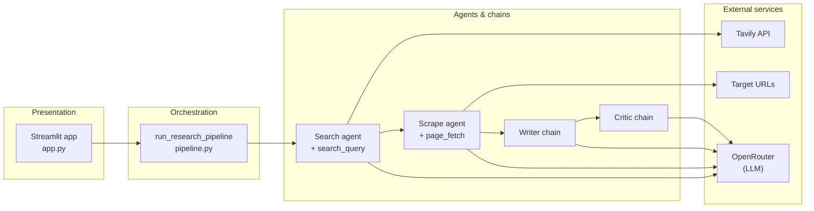

<div align="center">

# Re:search

**Automated research you can trust**

[](https://www.python.org/downloads/)
[](https://streamlit.io/)
[](https://www.langchain.com/)
[](https://openrouter.ai/)
[](https://tavily.com/)

</div>

---

## Overview

**Re:search** is a multi-step research assistant: it searches the web, deep-reads a chosen page, drafts a structured report, then runs a dedicated critic pass for quality control. The product ships as a **Streamlit** app with an optional **CLI** entry point.

**Pipeline:** Search → Scrape → Write → Critic

---

## Architecture

High-level flow: the UI calls a single orchestrator (`pipeline.py`), which wires **LangChain** agents (search + scrape with tools) and **prompt chains** (writer + critic) around one chat model served via **OpenRouter**.



| Layer | Responsibility |
|--------|----------------|
| **`app.py`** | Topic input, live step status, tabs for overview / raw outputs / report / critic. |
| **`pipeline.py`** | Ordered execution, timings, optional `on_step` hooks for progress UI. |
| **`agents.py`** | `create_agent` for search & scrape; `writer_chain` and `critic_chain` as LCEL pipelines. |
| **`tools.py`** | `search_query` (Tavily), `page_fetch` (HTTP + BeautifulSoup). |
| **`main.py`** | Minimal CLI: stdin topic → same pipeline (no web UI). |

---

## Getting started

### Prerequisites

- **Python 3.11+**
- API keys: **OpenRouter** (LLM) and **Tavily** (web search)

### 1. Clone and environment

```bash
git clone <your-repo-url>
cd Re-search_agent
python3.11 -m venv .venv
source .venv/bin/activate   # Windows: .venv\Scripts\activate
```

### 2. Install dependencies

Using **pip** (project uses `pyproject.toml`):

```bash
pip install -e .
```

Or install from `pyproject.toml` without editable mode:

```bash
pip install .
```

### 3. Configure secrets

Create a **`.env`** file in the project root:

```env
OPENROUTER_API_KEY=your_openrouter_key
TAVILY_API_KEY=your_tavily_key
```

Optional OpenRouter branding headers (see LangChain OpenRouter docs): `OPENROUTER_APP_TITLE`, `OPENROUTER_APP_URL`.

### 4. Run the app

**Web UI (recommended):**

```bash
streamlit run app.py
```

Open the URL shown in the terminal (default `http://localhost:8501`), enter a topic, and run **Run research**.

**CLI (headless):**

```bash
python main.py
```

---

## Project layout

```
Re-search_agent/
├── app.py           # Streamlit product UI
├── pipeline.py      # Research orchestration
├── agents.py        # Agents + writer/critic chains
├── tools.py         # Tavily search + page fetch tool
├── main.py          # CLI entry
├── pyproject.toml   # Dependencies & metadata
└── README.md
```

---

## Tags & topics

Suggested **GitHub topics** (repository labels) for discovery:

`research-agent` · `streamlit` · `langchain` · `langchain-agents` · `openrouter` · `tavily` · `llm` · `python` · `multi-agent` · `rag-lite`

---

## Roadmap

- [x] Project setup & dependencies  
- [x] Tooling (search + page fetch)  
- [x] Agent chains (search, scrape, writer, critic)  
- [ ] Pipeline hardening (retries, richer source selection, tests)  

---

<div align="center">

<sub>Built with LangChain agents, Streamlit, and OpenRouter.</sub>

</div>
