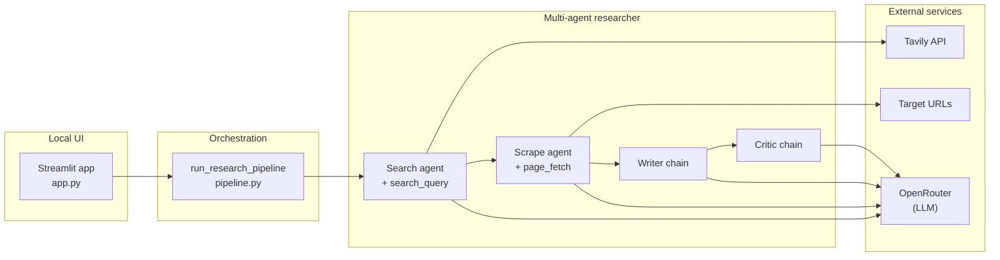

<div align="center">


# Re:search

**Local multi-agent researcher** · automated research you can run on your machine

[](https://www.python.org/downloads/)
[](https://streamlit.io/)
[](https://www.langchain.com/)
[](https://openrouter.ai/)
[](https://tavily.com/)

[](https://twitter.com/intent/follow?screen_name=asheshjyotii)

</div>

---

## Overview

**Re:search** is a **local multi-agent researcher**: specialist agents run in sequence on your machine (via **LangChain**), while you keep control of keys and data in your own environment. Together they **search** the web, **scrape** a high-signal page, **write** a structured report, and **critique** the draft for quality—exposed as a **Streamlit** UI with an optional **CLI**.

**Agent pipeline:** Search → Scrape → Write → Critic

---

## Architecture

The **local researcher** is orchestrated in one place: the UI calls `run_research_pipeline` in `pipeline.py`, which composes **multiple LangChain agents** (tool-using search and scrape) plus **writer** and **critic** chains, all backed by one chat model through **OpenRouter**. Tavily and target URLs are the only external I/O besides the LLM API—your app process stays local.



| Layer | Responsibility |
|--------|----------------|
| **`app.py`** | Local web UI: topic input, live agent-step status, tabs for overview / raw outputs / report / critic. |
| **`pipeline.py`** | Multi-agent sequence: ordered execution, timings, optional `on_step` hooks for progress UI. |
| **`agents.py`** | Agent definitions: `create_agent` for search & scrape; `writer_chain` and `critic_chain` as LCEL pipelines. |
| **`tools.py`** | `search_query` (Tavily), `page_fetch` (HTTP + BeautifulSoup). |
| **`main.py`** | Minimal CLI: stdin topic → same pipeline (no web UI). |

---

## Getting started

### Prerequisites

- **Python 3.11+**
- API keys: **OpenRouter** (LLM) and **Tavily** (web search)

### 1. Clone and environment

```bash
git clone <repo-url>
cd Re-search_agent
python3.11 -m venv .venv
source .venv/bin/activate   # Windows: .venv\Scripts\activate
```

### 2. Install dependencies

Using **pip** (project uses `pyproject.toml`):

```bash
pip install -e .
```

Or install from `pyproject.toml` without editable mode:

```bash
pip install .
```

### 3. Configure secrets

Create a **`.env`** file in the project root:

```env
OPENROUTER_API_KEY=your_openrouter_key
TAVILY_API_KEY=your_tavily_key
```

Optional OpenRouter branding headers (see LangChain OpenRouter docs): `OPENROUTER_APP_TITLE`, `OPENROUTER_APP_URL`.

### 4. Run the app

**Web UI (recommended):**

```bash
streamlit run app.py
```

Open the URL shown in the terminal (default `http://localhost:8501`), enter a topic, and run **Run research**.

**CLI (headless):**

```bash
python main.py
```

---

## Project layout

```
Re-search_agent/
├── app.py           # Local Streamlit UI for the researcher
├── pipeline.py      # Multi-agent research orchestration
├── agents.py        # LangChain agents + writer/critic chains
├── tools.py         # Tavily search + page fetch tool
├── main.py          # CLI entry
├── pyproject.toml   # Dependencies & metadata
└── README.md
```

---

## Tags & topics

`local-first` · `multi-agent` · `research-agent` · `langchain-agents` · `streamlit` · `openrouter` · `tavily` · `llm` · `python`

---

<div align="center">

<sub>Local multi-agent researcher — LangChain · Streamlit · OpenRouter</sub>

</div>
